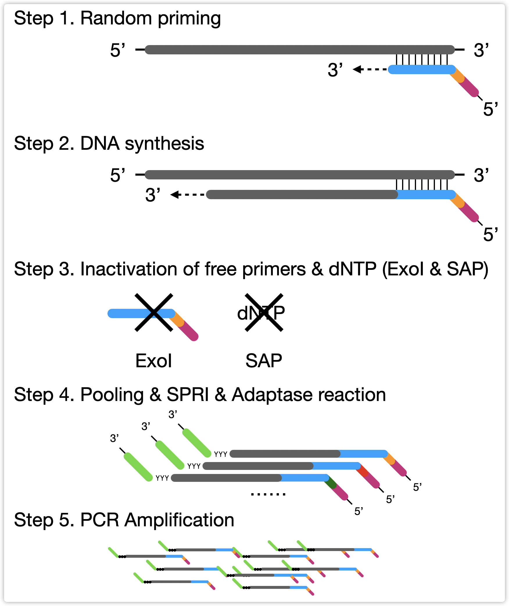

# Barcoding

We use two barcoding strategies to do cell barcoding for all the technologies we developed. The first version \(V1\) used in all the data generated before Summer 2020. After that, in most projects, we switched to the second version \(V2\) which has a larger barcoding capacity. 

All the sequences of barcodes are predefined, we can use that to trace the exact well in the plate, as you will see [in the mapping summary section](../mapping-summary-and-metrics/).

## Two round of barcoding


**Read** [**Luo 2017 Science**](https://science.sciencemag.org/content/357/6351/600.abstract) **\(snmC-seq\) and**[ **Luo 2018 Nat. Comm**](https://www.nature.com/articles/s41467-018-06355-2) **\(snmC-seq2, with V1 barcoding\) for more details.**   
Note that V2 barcoding hasn't been published yet. \(09/22/2020\)


Both versions contain two rounds of barcoding, the first round of barcodes introduced by random primer, the second round of barcodes introduced by PCR primer. The difference between V1 and V2 is the length and combination of barcodes.

In my pipeline, 

* the barcode on the random primer is referred to as a **random index**. 
* the barcode \(pair\) on the PCR primer is referred to as a **PCR index**.

Below is the final DNA fragment structure after library preparation. The PCR index is paired and occurs at both 3' and 5' of the fragment and in both R1 and R2. The random index only occurs at 5' of the fragment or the R1.

## Version 2 \(V2\) - Spring 2020 to Now

In V2 barcoding, we have 384 random indexes to give each well of one 384-well plate a unique barcode. We then use 6 PCR index, each barcoding four columns of the plate \(which is redundant barcoding\). For a typical eight-plate experiment \(3072 wells/cells in total\), we will use 384 \* 6 \* 8 barcode combinations.

The four columns barcoded by each PCR index is shown below, in my pipeline, I call that **multiplex group**. Each plate should have multiplex group 1 to 6.

## Version 1 \(V1\) - Before Spring 2020

In V1 barcoding, we have 8 random indexes to barcode two 384-well plates \(768 wells/cells\) together. This results in a 96-Well plate, which has 4 wells/cells' DNA been merged together. We then use a quarter \(96\) of the PCR indexes \(we have 384 kinds of PCR indexes in total, so 96 is a quarter\) to barcoding each well of the 96-well plate. Then we can merge them together. For a typical eight-plate experiment \(3072 wells/cells in total\), we will use 8 \* 96 \* 4 barcode combinations.

